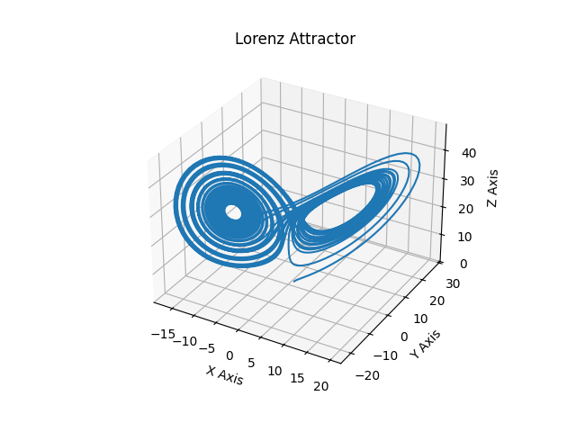

# PyDynSys: A Pythonic Framework for Dynamical Systems

[](https://badge.fury.io/py/pydynsys)
[](https://opensource.org/licenses/MPL-2.0)
[](https://travis-ci.org/jg1011/pydynsys)
[](https://codecov.io/gh/jg1011/pydynsys)

**PyDynSys** is a powerful, intuitive Python library for the analysis of continuous-time dynamical systems. It provides a high-level API for defining, solving, and analyzing systems from their symbolic equations or numerical vector fields. 

## Key Features

*   **Symbolic & Functional Support**: Initialise systems with either `Sympy` or a callable function, both yield full functionality by `Sympy` lambdification.
*   **Property Detection**: Automatically detect and compose systems with properties like linearity or Hamiltonian structure, providing additional 
insight and functionality at no expense. 
*   **Dual System Types**: First-class support for both `Autonomous` (dx/dt = F(x)) and `Non-Autonomous` (dx/dt = F(x, t)) systems with our public-facing API.
*   **Built-in Solvers**: Leverages the robust, adaptive solvers from `scipy.integrate.solve_ivp` under the hood for our public APIs, while still allowing advanced consumers to utilise local solvers.
*   **Bidirectional Integration**: Effortlessly compute trajectories forward and backward in time from any initial condition.
*   **Rich Trajectory Objects**: Work with trajectory data as standalone objects, with support for interpolation, analysis, caching & visualisation. 

## Installation

You can install `PyDynSys` via pip:

```bash
pip install pydynsys
```

To get the latest development version, you can clone the repository and install it in editable mode:

```bash
git clone https://github.com/your-username/pydynsys.git
cd pydynsys
pip install -e .
```

For contributors, to edit docs or access our `pytest` testing framework instead install via 

```bash
pip install -e ".[full]"
```

## Quickstart: The Lorenz Attractor

We'll plot a trajectory of the famous Lorenz system to hit the ground running. 

```python
import numpy as np
import sympy as syp
import matplotlib.pyplot as plt
from PyDynSys.core import AutDynSys

# 1. Define the system symbolically
t = syp.Symbol('t')
x, y, z = syp.symbols('x y z', cls=syp.Function)

lorenz_eq = [
    syp.Eq(x(t).diff(t), 10 * (y(t) - x(t))),
    syp.Eq(y(t).diff(t), x(t) * (28 - z(t)) - y(t)),
    syp.Eq(z(t).diff(t), x(t) * y(t) - (8/3) * z(t))
]
variables = [x(t), y(t), z(t)]

# 2. Create an autonomous system instance via our from_symbolic factory
system = AutDynSys.from_symbolic(lorenz_eq, variables)

# 3. Define initial conditions and evaluation space
x0 = np.array([1.0, 1.0, 1.0])
t_eval = np.linspace(0, 40, 5000)

# 4. Solve for the trajectory
## t_span is (t_start, t_end) for the solver
traj = system.trajectory(initial_state=x0, t_span=(0, 40), t_eval=t_eval)

# 5. Plot the result
fig = plt.figure()
ax = fig.add_subplot(111, projection='3d')
ax.plot(traj.y[0, :], traj.y[1, :], traj.y[2, :])
ax.set_xlabel("X Axis")
ax.set_ylabel("Y Axis")
ax.set_zlabel("Z Axis")
ax.set_title("Lorenz Attractor")
plt.show()
```

This will yield the following familiar plot: 



If we were being concise, to get this trajectory (exculiding the Matplotlib logic) takes only 5 lines of Python using `PyDynSys`. Not half bad! Though the true power of this library comes from our property mixin system, which can be seen in our [examples](https://jg1011.github.io/PyDynSys/examples/)

## Community & Usage

Are you using `PyDynSys` in your research or at your company? We'd love to hear from you!

Please consider opening a pull request to add your organization's name to our list of users. It helps the project's visibility, provides valuable feedback, and lets us know we're on the right track.

## Documentation

Full documentation, including an API reference and tutorials, is available on [our website](https://jg1011.github.io/PyDynSys/).

## Citing PyDynSys

If you use `PyDynSys` in your research, please cite it as follows:

```bibtex
@software{Green2025,
  author       = {Jacob Green},
  title        = {PyDynSys: A Pythonic Framework for Dynamical Systems},
  month        = {nov},
  year         = {2025},
  version      = {1.0.0},
  url          = {https://github.com/jg1011/PyDynSys}
}
```
*(Note: You can get a real DOI by archiving your repository with Zenodo)*

## Contributing

Contributions are welcome! Please see the `CONTRIBUTING.md` file for guidelines on how to submit bug reports, feature requests, and pull requests.

## License

`PyDynSys` is licensed under the Mozilla Public License 2.0. See the `LICENSE` file for more details. 